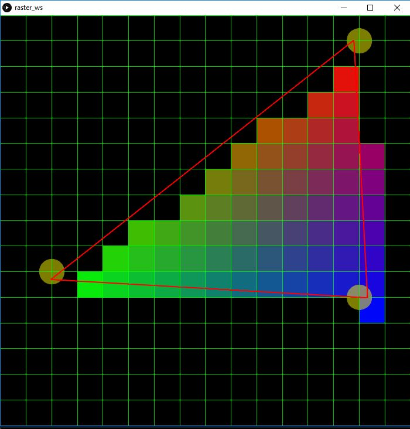

# Taller raster

## Propósito

Comprender algunos aspectos fundamentales del paradigma de rasterización.

## Tareas

Emplee coordenadas baricéntricas para:

1. Rasterizar un triángulo; y,
2. Sombrear su superficie a partir de los colores de sus vértices.

Referencias:

* [The barycentric conspiracy](https://fgiesen.wordpress.com/2013/02/06/the-barycentric-conspirac/)
* [Rasterization stage](https://www.scratchapixel.com/lessons/3d-basic-rendering/rasterization-practical-implementation/rasterization-stage)

Opcionales:

1. Implementar un [algoritmo de anti-aliasing](https://www.scratchapixel.com/lessons/3d-basic-rendering/rasterization-practical-implementation/rasterization-practical-implementation) para sus aristas; y,
2. Sombrear su superficie mediante su [mapa de profundidad](https://en.wikipedia.org/wiki/Depth_map).

Implemente la función ```triangleRaster()``` del sketch adjunto para tal efecto, requiere la librería [frames](https://github.com/VisualComputing/frames/releases).

## Integrantes

Dos, o máximo tres si van a realizar al menos un opcional.

Complete la tabla:

| Integrante | github nick |
|------------|-------------|
| Ivan Dario Gonzalez Collazos | ivdgonzalezco |
| Cristian Andres Garcia Prieto | crigar |

## Discusión

La rasterización de puntos se hizo a partir de la guía presentada en el primer enlace, donde se implemento la función *edge* y con ella se determinaron que puntos estaban dentro del area del triángulo. Además, se hizo uso de la interpretación de las coordenadas baricentricas para el color para poder dare a cada pixel (un rectángulo) el color con la tonalidad deseada, teniendo cada vertice el color primario (RGB). 

Este es el resultado:



## Entrega

* Modo de entrega: [Fork](https://help.github.com/articles/fork-a-repo/) la plantilla en las cuentas de los integrantes.
* Plazo: 30/9/18 a las 24h.
